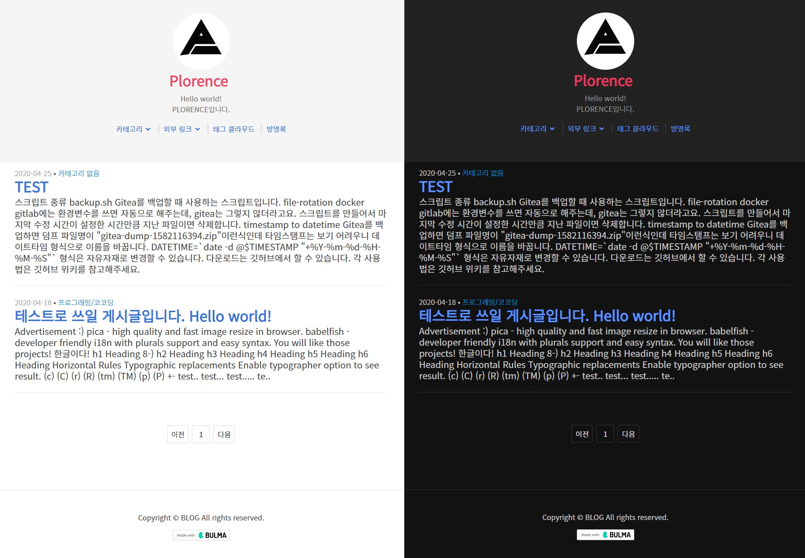

> 나는 이 게임을 해봤어요!! - <cite>성기훈[^1]</cite>

[^1]: 성기훈은 배우 이정재가 연기한 오징어 게임 2의 주인공

최근 오징어 게임 2가 나오면서 작중 위 대사가 밈으로 유행했다. 해당 대사처럼 나는 이 블로그를 개발하기 이전에 티스토리 블로그 스킨을 개발한 적 있다. <br/>
티스토리 블로그를 시작으로 티스토리 스킨 개발을 거쳐 왜 직접 블로그를 만들기까지 했는지 내용을 담았다.

## 티스토리

티스토리 전에는 네이버 블로그를 사용했었다. 하지만 네이버 블로그는 순전히 마인크래프트라는 게임의 글만 썼었고 개발도 하지 않았다.
당시 마인크래프트 블로그는 네이버 블로그가 일종의 국룰(?)로 잡혀있었다. 각종 모드, 스킨, 맵, 기타 강의 등 도움 될만한 고품질의 글이 꽤 많았다.

네이버 블로그를 그대로 썼을 수도 있지만, 개발 입문 한참 전에 모종의 사건으로 블로그가 초기화되어 새 출발하고자 새로운 플랫폼으로 이주하고자 했다.

비교적 이주할 플랫폼은 그리 어렵지 않게 골랐다. 개발 블로그 중에 티스토리가 많았고, 검색엔진에 노출 잘되고, 무료이기 때문에 안고를 이유가 없었다.
블로그 커스터마이징 자유도도 꽤 높은 것도 한몫했다.

티스토리 블로그를 만들 당시에는 스킨에 대한 큰 욕심이 없었다. 무료에, 검색엔진에 노출만 잘된다면 _"글만 잘쓰면 됐지"_ 라고 생각했기 때문이다.
이 생각은 지금도 비슷하다. 아무리 이쁘장하게 만들어도 글의 품질이 낮다면 아무런 의미가 없다. 대부분은 블로그를 보러 온 게 아니라 작성한 글을 보러 왔으니까.

그럼에도 티스토리 블로그를 운영하면서 _"이랬으면 좋았을텐데.."_ 라는 생각은 꾸준히 들었다. <br/>
평소처럼 개발하면서 검색해 나온 여러 블로그 중에 유독 **보기 좋고, 글도 잘 읽히는 블로그**가 있었다. 따라 하고 싶었는데 어떤 스킨을 적용해도 그 느낌이 안 들었다. CSS를 복사하고 폰트를 적용해도 그 블로그 같은 느낌은 안 났다.

타 플랫폼으로 이전도 생각했지만, 마땅히 이주할 곳도 없고 작성한 글도 너무 아까웠다. <br/>
그래서 나는 티스토리 스킨을 만들었다.

### Plore



2020년 초 개발한 티스토리 스킨의 이름이 [Plore](https://github.com/mschadev/plore)이다. 딱히 뜻은 없고 내 닉네임인 Plorence에서 앞 글자만 적당히 잘라내서 따왔다.
심플하면서 필요한 건 다 있고, 앞서 말한 보기 좋고 잘 읽히는 그런 스킨을 원했었다.

하지만 오래가지 못했다. 그 당시엔 웹 개발은 워낙 자신 없기도 했었고 [큐널 베이식](https://qunul.tistory.com/47)이라는 스킨을 발견했기 때문이다. [^3]
내 스스로가 결과물에 만족하지 못한 것도 있고 유료 스킨이긴 했지만 내가 추구하는 디자인에 가장 가깝고 생각보다 저렴한 가격이라 구매했다.
[^3]: 큐널 베이직의 스킨 공개는 2020년 6월 4일, Plore 저장소는 2020년 6월 6일에 read-only로 변경함

### 큐널 베이직


스킨을 구매한 후 적용할 때 정말 만족감이 좋았다. 대한민국 국경일에 내가 설정한 로고 대신 태극기 로고가 설정되는 재미난 기능도 있었고,
인덱스 페이지에서 어떤 목록 스타일로 보여줄 것인지, 개발자라면 좋아할 만한 다크 모드도 구현되어 있었다.
간간이 이메일로 큐 늘 개발자님께 버그 제보도 했었는데 피드백도 좋았다.

누군가 티스토리 블로그를 운영하겠다고 하면 추천할 만한 스킨이다.

## 블로그 일시 중단

[내 티스토리 블로그](https://plorence.tistory.com)를 보면 알겠지만 2022년에 쓴 글 2개를 제외하면 2020월 4분기부터 현재(2025년 1월)까지 글을 쓰지 않았다.
개인적인 일도 있었고, _"글 쓰기 너무 귀찮다., 질 낮은 글이나 어딘가에 많이 있을법한 글을 쓸 거면 블로그에 쓰지 말자"[^4]_ 라는 생각이 지배적이었다.
[^4]: 메모나 공부한 건 전부 에버노트(나중에 노션으로 이전)에 작성하고 있었음

그렇게 블로그를 방치하다가 작년부터 미뤘던 스킨 업데이트를 했다. 순조롭게 진행되는 듯했지만, 어느 순간부터 검색 기능, 마크다운의 코드 블록 등 제대로 작동하지 않았다.
내가 마이그레이션하다 실수한 거겠지만 오랜만에 건드는 부분이라 손쓰기 어려웠다.

그때 머릿속을 스쳐 간 게 있었다. _"블로그를 직접 만들까?"_ <br/>
예전부터 _"개발자라면 직접 만든 블로그 정도는 있어야 하지 않겠어?"_ 같은 나만의 로망이 있었다.
블로그가 엄청 복잡한 시스템도 아니고 _"일단 천천히라도 해보자"_ 해서 막무가내로 진행했다.

## 블로그 설계

블로그 설계는 충분한 시간을 들였다. [bazzi.gg](https://github.com/bazzi-gg), [era1890.org](https://era1980.org)를 개발하면서 뼈저리게 느낀 건 충분한 고민과 설계를 하고 코드 작성을 해야 한다는 것이다. [^5]
[^5]: https://news.hada.io/topic?id=11362

프로젝트는 아래 순서로 진행했다.

1. 디자인
2. 기술 스택 선정
3. 개발

## Figma로 디자인

Figma는 앞서 언급한 프로젝트와 디자인만 하다 버려진 프로젝트가 꽤 있고, 워낙 익숙한 툴이라 그리 어렵진 않았다. <br/>
전체적인 방향이나 레이아웃은 plore를 따르면서 여러 블로그를 돌아다니면서 참고하였다.


디자인하면서 요구사항이나 기능도 같이 고려했기 때문에 초안 정도만 그리고 나머지는 상상 속에 맡겼다. 대표적으로 지금 보고 있는 글의 오른쪽에 고정된 목차가 개발하면서 추가된 기능이다. <br/>
다크 모드나 모바일 디자인은 반응형으로 개발하면 자연스레 나올 것 같아 따로 디자인은 하지 않았다.

## 어떤 프레임워크를 쓸 것인가?

생각나는 건 [Svelte](https://svelte.dev), [Nuxt](https://nuxt.com), [Astro](https://astro.build)였다. Nuxt는 Vue와 함께 내가 주력으로 사용하고 있었고, Svelte는 자주 써보진 않았지만, 간단한 프로젝트[^6]에서 경험이 나쁘지 않았다. 반면 Astro는 들어보기만 했지 사용해보진 않았다.
[^6]: Svelte 4 사용. 아쉽게도 출시까지 이어지진 않음

기술 스택 선정에 있어서 얼마나 익숙한 도구인가도 중요하지만, 그보다 퍼포먼스를 더 중요시했다. 블로그라는 게 많은 기능을 요구하지도 않고 정적인 콘텐츠가 대부분이기 때문이다. 그래서 렌더링 방식은 SSG를 택했다.

### Svelte

Nuxt와 Vue에 비하면 깊은 지식을 가지고 있지 않지만 빌드 시점에서 Vanilla JS로 변환되는 점, 런타임 라이브러리가 존재하지 않은 장점 때문에 후보에 올렸다. <br/>
그럼에도 탈락한 이유는

1. 5버전이 되면서 [Runes](https://svelte.dev/blog/runes) 도입(굳이 써야 하나)
2. 안 그래도 Svelte에 대한 지식이 부족한데 또 학습이 필요한 점

이제 와서 4버전을 쓸 수도 없는 노릇이고 블로그 개발에 필요한 기능 대비 러닝 커브가 높다고 판단했다.

### Nuxt

Nuxt는 [공식 문서](https://nuxt.com/docs/guide/concepts/rendering#deploying-a-static-client-rendered-app)에 나와 있는 `nuxi generate` 커맨드를 사용하여 정적 웹사이트로 빌드가 가능하다. 블로그를 만들기 위해 `npm create nuxt@latest` 명령어로 3.15.4버전의 기본 템플릿 프로젝트를 만들고 마크다운 콘텐츠를 위해 [NuxtContent](https://content.nuxt.com)를 세팅하고 정적 웹사이트로 만들어봤다.


자바스크립트 리소스 사이즈만 `264KB(0.26MB)`이다. 마크다운으로 작성된 콘텐츠가 완전한 HTML로 빌드되는 게 아닌 SQL 기반 스토리지로 작동하기 때문에 더더욱 자바스크립트가 필요하다.

### Astro

Nuxt와 다르게 Astro는 별다른 설정 없이 디폴트가 정적 웹사이트로 빌드된다. 블로그를 만들기 위해 `npm create astro@latest` 명령어로 5.3.1버전의 블로그 템플릿 프로젝트를 만들었다.


**빌드된 결과물에는 자바스크립트가 없다.**

추가로 코드 하이라이터인 [shiki](https://shiki.matsu.io/)(결국 사용하진 않았지만)가 내장된 것에도 점수를 줬다.

Astro와 많은 통합과 정적 웹사이트 결과물에서는 Nuxt보다 Astro가 우위므로 Astro를 택했다.

## Astro로 개발

블로그 개발을 염두에 두고 있다면 Astro로 개발할 수 있도록 어떤 매력을 가졌는지 소개하려 한다.

Astro는 기본적으로 정적 웹사이트로 빌드한다. JS(TS) 코드는 웹 환경에서 동적으로 DOM을 제어해야 한다거나, Web API가 필요한 케이스가 아니라면 HTML 생성을 위해 빌드 타임에 실행된다. Astro가 콘텐츠(블로그 글)를 어떻게 빌드 타임에 생성하는지 알아본다.

### Markdown 관리

Markdown을 어디서 찾을 것인지, 콘텐츠의 스키마를 검증할 것인지 코드로 작성해야 한다.
Astro는 Markdown, YAML, JSON같은 콘텐츠를 관리하기 위해 [콘텐츠 컬렉션](https://docs.astro.build/ko/guides/content-collections/)을 사용해 정의한다.

```ts title="src/content.config.ts"
import { glob } from "astro/loaders";
import { defineCollection, reference, z } from "astro:content";

const post = defineCollection({
  loader: glob({
    base: "./src/content/post", // 콘텐츠가 존재하는 디렉터리
    pattern: "**/*.MD",
  }), // 최종적으로 src/content/post/**/*.MD

  // zod로 glob패턴에 일치한 마크다운 파일들의 Frontmatter 스키마를 검증한다.
  schema: z.object({
    title: z.string(),
    description: z.string(),
    pubDate: z.coerce.date(),
    updatedDate: z.coerce.date().optional(),
  }),
});
export const collections = { post };
```

정의한 컬렉션은 `collections` 객체 안에 추가하여 내보내기를 통하여 등록해야 한다. 위에서 정의한 컬렉션을 변수 `post`에 대입하고 내보냈으니 컬렉션 명은 `post`가 된다.

### post 컬렉션 불러오기

서버가 있는 웹사이트라면 일반적으로 아래 순서대로 작동한다.

1. 웹사이트 접속
2. 서버에 글 리스트 요청
   3....
3. 서버로부터 받은 글 리스트 보여주기

Astro에서는 위에서 정의한 컬렉션을 기반으로 `getCollection` API를 사용해 불러온다.

```astro title="src/pages/index.astro" {1,7} showLineNumbers
---
import { getCollection } from "astro:content";
import BaseLayout from "@/layouts/BaseLayout.astro";
const posts = (await getCollection("post")).sort(
  (a, b) => b.data.pubDate.valueOf() - a.data.pubDate.valueOf(),
);
---

<BaseLayout>
  <h1>모든 글(최신 순)</h1>
  <ul>
    {
      posts.map((post) => (
        <li>
          <a href={`/post/${post.id}`}>{post.data.title}</a>
        </li>
      ))
    }
  </ul>
</BaseLayout>
```

Astro는 파일 기반 라우팅을 사용하므로 `/src/pages/`디렉터리의 파일 레이아웃 기반으로 페이지를 생성한다.
또한 해당 경로에 있는 `.ASTRO` 파일은 HTML로 빌드된다.

1번 라인의 `---`시작과 7번 라인의 `---`끝을 [Code Fence](https://docs.astro.build/ko/basics/astro-components/#%EC%BB%B4%ED%8F%AC%EB%84%8C%ED%8A%B8-%EC%8A%A4%ED%81%AC%EB%A6%BD%ED%8A%B8)라고 부르며 빌드 타임에 실행되는 코드다. HTML로 빌드하기 위해 변수 `posts`는 빌드 타임에 값을 가지며 HTML코드에 있는 `{ posts.map(...) }`도 이때 실행된다.
즉 위 Astro 파일은 최종적으로 `/index.html`가 된다.

### 동적 경로로 블로그 글 페이지 생성하기

서버가 있는 웹사이트라면 일반적으로 아래 순서대로 작동한다.

1. 웹사이트 접속
2. Path Parameter에 해당하는 글을 서버에 요청
   3....
3. 서버로부터 받은 글 보여주기

Astro에서는 동적 경로를 위해 파일명을 `[].astro`으로 만들어야 한다.
동적 경로 또한 빌드 타임에 결정 되어야 하기 때문에 `getStaticPaths` 함수 리턴값을 통해 전달한다.

```astro title="src/pages/post/[...slug].astro" {10}
---
import { type CollectionEntry, getCollection } from "astro:content";
import BaseLayout from "@/layouts/BaseLayout.astro";
import { render } from "astro:content";

export async function getStaticPaths() {
  const posts = await getCollection("post");
  return posts.map((post) => {
    return {
      params: { slug: post.id },
      props: { post },
    };
  });
}

const props = Astro.props;
const { Content } = await render(props.post);
---

<BaseLayout>
  <Content />
</BaseLayout>
```

`getStaticPaths`함수가 반환한 데이터들을 기반으로 빌드 타임에 페이지(HTML)를 생성한다. `params.slug`는 파일명에 있는 `src/pages/posts/[...slug].astro`를 결정한다.

```ts {10,15} showLineNumbers
import { type CollectionEntry, getCollection } from "astro:content";
import BaseLayout from "@/layouts/BaseLayout.astro";
import { render } from "astro:content";

export async function getStaticPaths() {
  const posts = await getCollection("post");
  return posts.map((post) => {
    return {
      params: { slug: post.id },
      props: { post },
    };
  });
}

const props = Astro.props;
const { Content } = await render(props.post);
```

10번 라인에 있는 `props` 객체는 `Astro.props`로 전달하므로 변수 `post`의 값은 `Astro.props`로 접근할 수 있다.

### 동적 경로 시나리오

컬렉션 정의할 때 glob 패턴이 `src/content/post/**/*.MD`(위에서 정의한 컬렉션 그대로)라고 가정한다. 그런 다음 아래의 구조로 마크다운 파일을 생성했다.

```text
.
└── content/
    └── post/
        ├── 첫-번째-포스트.MD
        └── 두-번째-포스트.MD
```

`getStaticPaths`함수가 실행되면 아래와 같은 배열을 리턴한다.

```json
[
    {
        params: {
            slug: "첫-번째-포스트"
        },
        props:{
            post: {...} // CollectionEntry<"post">;
        }
    }
        {
        params: {
            slug: "두-번째-포스트"
        },
        props:{
            post: {...} // CollectionEntry<"post">;
        }
    }
]
```

이제 이 데이터를 기반으로 `/post/첫-번째-포스트.html`, `/post/두-번째-포스트.html` 페이지가 생성된다.<br/>
이처럼 아주 간단한 코드 작성으로 정적 콘텐츠를 생성할 수 있다.

## 나머지 장점

여기서 소개하지 않았지만 핵심 기능 중 하나인 React, Vue, Svelte 등 여러 프레임워크의 컴포넌트[^7]를 사용할 수 있다.
[^7]: https://docs.astro.build/ko/concepts/islands/

개인적으로 느낀 건

- 잘 정리되어 있는 공식 문서와 한글 번역(번역이 정말 잘되어 있다)
- 낮은 러닝 커브
- 타입스크립트 지원
- VS Code 지원(확장)
- Tailwind 지원

## 배포

개인, 소규모 개발자에게 어울리고 미친 가성비를 자랑하는 업체인 Cloudflare의 [Pages](https://pages.cloudflare.com/)를 선택했다. 무료 플랜도 트래픽 무제한에 ICN 리전으로 연결된다.

티스토리 블로그를 삭제하진 않을 것이다. 그래서 검색 엔진에 색인된 blog.plorence.dev URL은 티스토리 블로그로 Redirect 시켜줘야 했는데 Cloudflare의 [\_redirects](https://developers.cloudflare.com/pages/configuration/redirects/)파일을 사용했다. Redirect 규칙은 티스토리 블로그의 sitemap.xml 내용을 정규식으로 빠르게 작성했다.


## 참조

- [모든 HTML 요소가 포함된 블로그 포스트(news.hada.io)](https://news.hada.io/topic?id=10335)
- [블로그/개인 웹사이트에서 좋아하는 마이크로 기능들(news.hada.io)](https://news.hada.io/topic?id=15503)

아래의 블로그들에서 영감을 받았다.

- [Likilee](https://kilee.dev/blog)님 블로그
- [d5br5](https://d5br5.dev/blog)님 블로그
- [ccbikai](https://kai.bi/)님 블로그
- [noahflk](https://noahflk.com/blog)님 블로그
- [AdisonCavani](https://k1ng.dev/blog/markdown-style-guide)님 블로그
- [spoqa 기술 블로그](https://spoqa.github.io/index.html)
- [화해 기술 블로그](https://blog.hwahae.co.kr/)
